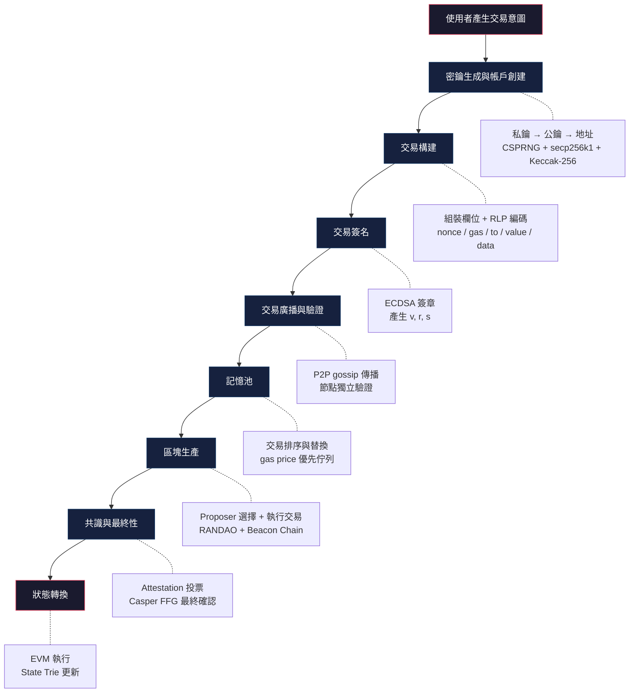
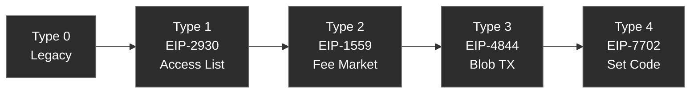

# 交易生命週期

## 概述

一筆 Ethereum 交易從使用者意圖到鏈上最終確認，經歷密鑰生成、交易構建、數位簽章、網路廣播、記憶池排隊、區塊打包、共識投票、狀態轉換等階段。每個階段都涉及特定的密碼學原語和協議機制。本筆記作為 Hub，串連整個流程。

## 完整流程圖



## 各階段詳解

### 1. 密鑰生成與帳戶創建

使用 [[CSPRNG]] 產生 256-bit 私鑰，透過 [[secp256k1]] 橢圓曲線乘法推導公鑰，再經 [[Keccak-256]] 雜湊取後 20 bytes 得到地址。整個過程不需要鏈上操作 -- 帳戶在第一筆交易時才「實體化」到 [[State Trie]] 中。

詳見：[[密鑰生成與帳戶創建]]

### 2. 交易構建

組裝交易的各個欄位：[[Nonce]]（防重放序號）、gas 相關參數（[[Gas]] / [[EIP-1559 費用市場]]）、目標地址、轉帳金額、calldata。Legacy 交易用 [[RLP 編碼]] 序列化；EIP-2718 之後的 typed transaction 在 RLP 前加上 type prefix。

詳見：[[交易構建]]

### 3. 交易簽名

對序列化後的交易取 [[Keccak-256]] 雜湊，再用 [[ECDSA]] 以私鑰簽章，產生 `(v, r, s)` 三個值。`v` 值包含 recovery ID 和 chain ID（[[EIP-155 重放保護]]），讓驗證者能用 [[ECRECOVER]] 從簽章反推出簽署者公鑰。

詳見：[[交易簽名]]

### 4. 交易廣播與驗證

簽好的交易透過 `eth_sendRawTransaction` RPC 提交給節點，節點驗證簽章有效性、nonce 正確性、餘額充足性後，透過 DevP2P gossip 協議擴散到整個網路。

詳見：[[交易廣播與驗證]]

### 5. 記憶池

通過驗證的交易進入節點本地的 mempool。Mempool 不是共識層的一部分，各節點獨立管理。交易按 effective gas price 排序，高價交易優先被打包。使用者可透過相同 nonce 但更高 gas price 的交易替換 pending 交易。

詳見：[[記憶池]]

### 6. 區塊生產

[[Beacon Chain]] 透過 [[RANDAO]] 為每個 slot（12 秒）選出一個 Proposer。Proposer 從記憶池挑選交易、在 EVM 中依序執行、組裝 [[區塊結構|區塊]]。Execution payload 包含交易列表、state root、receipts root 等。

詳見：[[區塊生產]]

### 7. 共識與最終性

同一 slot 的 committee 驗證者對區塊投出 [[Attestation]]。[[LMD GHOST]] fork choice rule 決定鏈頭。每 32 slots 為一個 epoch，[[Casper FFG]] 在 epoch 邊界進行 justify 和 finalize 投票。一個 checkpoint 被 2/3 以上 stake 的驗證者投票後，該 checkpoint 之前的所有區塊獲得最終性，無法被逆轉。

詳見：[[共識與最終性]]

### 8. 狀態轉換

交易被區塊包含後，EVM 執行交易邏輯：轉帳 ETH、執行合約 bytecode、修改 [[Storage Trie]]。所有帳戶變更反映到 [[State Trie]]，計算新的 state root 寫入 [[區塊 Header]]。交易回執記錄 status、gas used、logs，寫入 [[Receipt Trie]]。

詳見：[[狀態轉換]]

## 時序與延遲

| 階段 | 典型延遲 | 備註 |
|------|----------|------|
| 簽名 | < 1ms | 本地運算 |
| 廣播到多數節點 | 1-3s | DevP2P gossip |
| 進入區塊 | 12s（1 slot） | 取決於 gas price 和 mempool 狀態 |
| 1 confirmation | 12s | 包含在一個區塊中 |
| Justified | ~6.4 min（1 epoch） | 2/3 投票通過 |
| Finalized | ~12.8 min（2 epochs） | 不可逆轉 |

## 交易類型演進



- **Type 0 (Legacy)**：gasPrice 統一定價，[[RLP 編碼]] 序列化
- **Type 1 (EIP-2930)**：引入 access list 降低跨合約呼叫 gas 成本
- **Type 2 (EIP-1559)**：baseFee + maxPriorityFeePerGas，費用更可預測
- **Type 3 (EIP-4844)**：引入 blob，大幅降低 L2 data availability 成本（[[EIP-4844 Proto-Danksharding]]）
- **Type 4 (EIP-7702)**：Set Code 交易，[[EOA]] 可設定委託合約代碼（Pectra，2025/5/7）

### EIP-7702 對交易生命週期的影響

Type 4 交易引入了 `authorization_list` 欄位，改變了交易執行的語義：

1. **交易構建**：除了標準 EIP-1559 欄位外，還需要包含一個 authorization list，每個 entry 指定 `chainId`、`address`（委託目標合約）、`nonce`，並由 EOA 簽名
2. **交易執行**：EVM 處理 authorization list 時，會將簽署者 EOA 的 code 設定為指定的 delegation designation
3. **後續互動**：設定委託後，其他交易呼叫該 EOA 時會執行委託合約的邏輯

這意味著一筆 Type 4 交易同時完成「設定委託」和「執行操作」，使用者體驗上可以把多步操作壓縮成一筆交易。

## 程式碼範例

完整的交易生命週期示範（建立 → 簽名 → 廣播 → 等待確認）：

```javascript
import { ethers } from 'ethers';

// 1. 建立 provider 和 wallet（密鑰生成）
const provider = new ethers.JsonRpcProvider('http://localhost:8545');
const wallet = new ethers.Wallet(process.env.PRIVATE_KEY, provider);

// 2. 構建交易（EIP-1559）
const tx = {
  type: 2,
  to: '0xRecipientAddress',
  value: ethers.parseEther('0.1'),
  nonce: await provider.getTransactionCount(wallet.address, 'pending'),
  maxFeePerGas: ethers.parseUnits('30', 'gwei'),
  maxPriorityFeePerGas: ethers.parseUnits('2', 'gwei'),
  gasLimit: 21000n,
  chainId: 1n,
};

// 3. 簽名（ECDSA over secp256k1）
const signedTx = await wallet.signTransaction(tx);
console.log('Signed TX:', signedTx);

// 4. 廣播到網路
const txResponse = await provider.broadcastTransaction(signedTx);
console.log('TX Hash:', txResponse.hash);

// 5. 等待確認（1 confirmation = 包含在區塊中）
const receipt = await txResponse.wait(1);
console.log('Block:', receipt.blockNumber);
console.log('Gas Used:', receipt.gasUsed.toString());
console.log('Status:', receipt.status === 1 ? 'Success' : 'Failed');

// 6. 等待最終性（可選，需要較長時間）
// Finality 在 PoS 下約需 2 epochs (~12.8 min)
const finalizedBlock = await provider.getBlock('finalized');
const isFinalized = receipt.blockNumber <= finalizedBlock.number;
console.log('Finalized:', isFinalized);
```

## 相關概念

- [[密鑰生成與帳戶創建]] - 流程第一步：產生帳戶
- [[交易構建]] - 流程第二步：組裝交易欄位
- [[交易簽名]] - 流程第三步：ECDSA 簽章
- [[交易廣播與驗證]] - 流程第四步：網路傳播
- [[記憶池]] - 流程第五步：等待打包
- [[區塊生產]] - 流程第六步：Proposer 組裝區塊
- [[共識與最終性]] - 流程第七步：投票確認
- [[狀態轉換]] - 流程第八步：執行與狀態更新
- [[Ethereum MOC]] - 知識庫主索引
