# Slot 與 Epoch

## 概述

Ethereum 的共識層把連續時間切成離散的固定單位：slot（12 秒）和 epoch（32 slots = 6.4 分鐘）。這套時間模型決定了出塊節奏、投票週期和最終性的速度。所有共識機制的運作——從 [[Validators]] 分配 committee、[[Attestation]] 投票到 [[Casper FFG]] 確認 finality——都建立在這個時間框架上。

## Slot：12 秒的設計權衡

一個 slot 是 [[Beacon Chain]] 的最小時間單位，固定 12 秒。每個 slot 最多產生一個區塊。

為什麼是 12 秒？這是網路延遲和用戶體驗之間的平衡：

- **太短（如 3-5 秒）**：區塊來不及傳播到全球所有節點，導致大量 missed slot 和分叉。家用網路的 validator 會嚴重劣勢，傷害去中心化。
- **太長（如 30-60 秒）**：用戶等待交易確認的時間過長，DApp 體驗變差。
- **12 秒**：讓全球節點有足夠時間接收區塊並完成投票，同時維持合理的交易確認速度。

Slot 編號從 0（Beacon Chain genesis）開始累計。不是每個 slot 都有區塊——如果 proposer 離線或未及時出塊，該 slot 就是空的（missed slot）。

## 一個 Slot 內的時序

一個 slot 的 12 秒被精確分為三個階段：

```mermaid
gantt
    title 一個 Slot 的時間分配（12 秒）
    dateFormat X
    axisFormat %s秒
    section 出塊
    Proposer 廣播區塊       :0, 4
    section 投票
    Attester 提交投票        :4, 8
    section 聚合
    Aggregator 聚合投票      :8, 12
```

| 時間點 | 動作 | 參與者 |
|--------|------|--------|
| **t=0** | Proposer 從 EL 取得交易，組裝 Beacon Block 並廣播 | 1 位 proposer |
| **t=4s** | Attester 對收到的區塊投票（[[Attestation]]） | 該 slot 的 committee 成員 |
| **t=8s** | Aggregator 將同 committee 的投票聚合為一份簽名並廣播 | 每 committee 約 16 位 aggregator |
| **t=12s** | 下一個 slot 開始 | - |

這個 4-4-4 的分割確保每個步驟都有足夠的網路傳播時間。

## Epoch：32 Slots 的批次處理

一個 epoch 包含 32 個 slot，歷時 6.4 分鐘。

為什麼是 32？主要考量是讓足夠數量的 validator 完成投票：

- Ethereum 目前有超過 100 萬個 active validator
- 每個 epoch 中，**每個 validator 恰好投一次票**
- 32 個 slot 讓 validator 可以均勻分散，每個 slot 約分配 3 萬多個 validator
- 如果 epoch 太短（如 8 slot），每個 slot 要處理的投票量太大，增加網路負擔
- 如果 epoch 太長（如 128 slot），finality 確認時間隨之拉長

Epoch 的邊界（每 32 個 slot）是重要的處理節點。在 epoch 交界時，[[Beacon Chain]] 會執行一系列批次操作：

- 計算上個 epoch 的 attestation 獎勵和懲罰
- 更新 [[Casper FFG]] 的 justification 和 finalization 狀態
- 處理 validator 進場（activation）和離場（exit）隊列
- 更新所有 validator 的 effective balance
- 進行下一個 epoch 的 committee 分配

## Checkpoint：Finality 的基礎

**Checkpoint** 是每個 epoch 第一個 slot 所對應的區塊。如果第一個 slot 是空的（missed），則使用往前最近的有效區塊。

$$\text{checkpoint}(e) = (\text{epoch} = e,\ \text{root} = \text{block\_root\_at\_slot}(32e))$$

Checkpoint 是 [[Casper FFG]] finality 流程的核心對象。Validator 在每次 attestation 中投兩票給 checkpoint：

- **Source vote**：指向最新的 justified checkpoint
- **Target vote**：指向當前 epoch 的 checkpoint

當超過 2/3 的質押權重投票連結兩個 checkpoint 時，target 被 **justified**（暫時確認）。當 justified 的 checkpoint 連續兩個 epoch 都被確認，前一個就被 **finalized**（永久確認，不可逆轉）。

正常情況下，一個區塊從產生到被 finalize 約需 2 個 epoch（12.8 分鐘）。

## Slot Number vs Block Number

一個常見的混淆：slot number 和 block number 不相同。

- **Slot number**：按固定 12 秒節奏遞增，不管有沒有區塊
- **Block number**：只有成功出塊才 +1

因此 slot number >= block number，差值等於歷史上所有 missed slot 的總數。查詢鏈上資料時需注意使用正確的編號。

## 相關概念

- [[Beacon Chain]] - 管理 slot/epoch 時間軸的核心
- [[Attestation]] - Validator 在每個 slot 的投票機制
- [[Casper FFG]] - 利用 checkpoint 達成 finality
- [[LMD GHOST]] - 每個 slot 的 fork choice 機制
- [[Validators]] - 被分配到各 slot 的 committee 中投票
- [[RANDAO]] - 決定每個 slot 的 proposer 和 committee 分配
- [[共識入門]] - 共識的基礎概念
